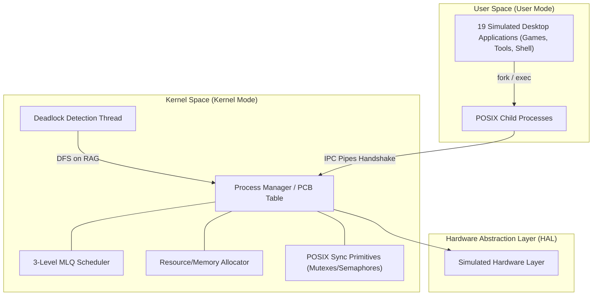
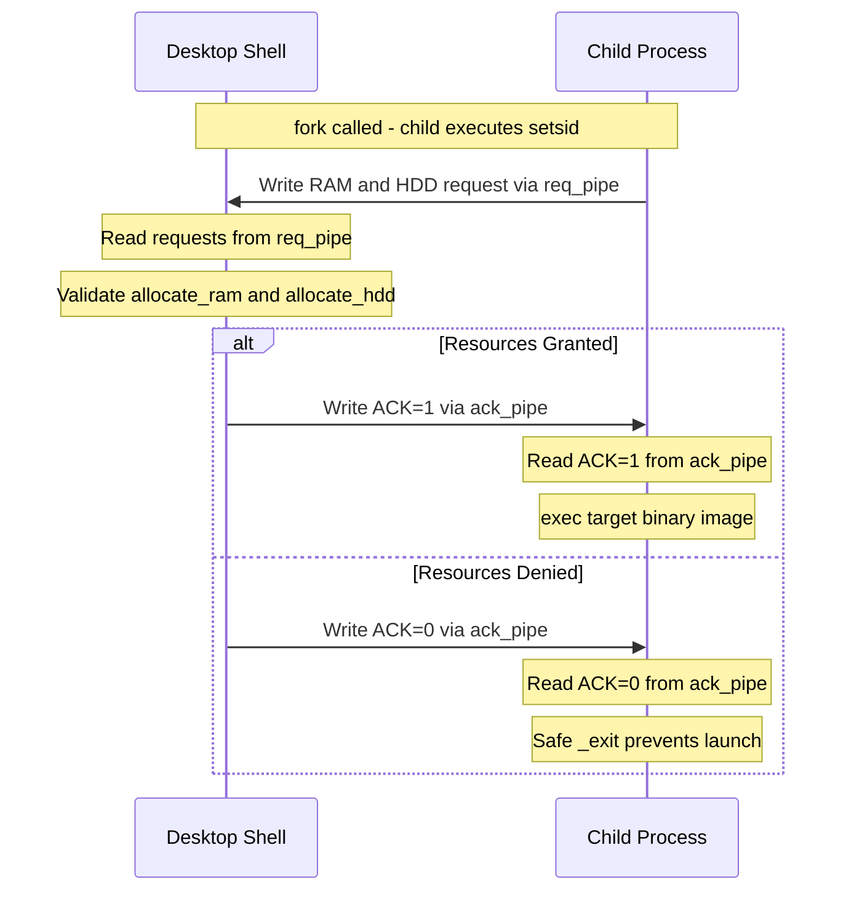
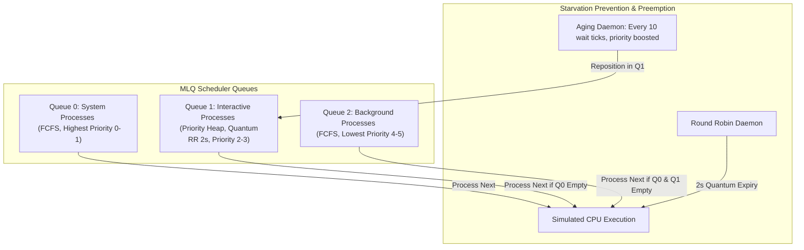

# 🌌 MaqOS — Maqsad Operating System

[](https://en.cppreference.com/w/cpp/17)
[](https://www.sfml-dev.org/)
[](https://ubuntu.com)
[](https://www.gnu.org/software/make/)
[](https://man7.org/linux/man-pages/man7/pthreads.7.html)

[MaqOS (Maqsad Operating System)](file:///c:/Users/NCS/Desktop/Operating-Systems---MaqOS-main/Operating-Systems---MaqOS-main/README.md) is a fully simulated desktop operating system environment written from the ground up in **C++17** and **SFML**. By bridging high-level graphic interfaces with real low-level POSIX kernel concepts, MaqOS models process tables, CPU schedulers, memory managers, and resource allocation policies. 

Unlike generic UI wrappers, MaqOS enforces **real OS constraints** at runtime: every application runs as a real child process spawned via `fork()` + `exec()`, resources (RAM/HDD/Cores) are negotiated via a **two-pipe IPC handshake**, CPU scheduling is regulated by a **3-level Multilevel Queue (MLQ) scheduler**, and a **deadlock detection engine** dynamically performs DFS cycle detection on a live Resource Allocation Graph.

---

## 🏗️ System Architecture

MaqOS is structured into a clean, four-layer modular architecture that separates user-space activities from simulated hardware pools:



### Architectural Layer Breakdown
1. **User Mode (User Space)**: Running 19 custom applications (productivity tools, games, file managers) that execute as real POSIX subprocesses.
2. **Kernel Mode (Kernel Space)**: Centrally manages the Process Control Block (PCB) table, handles resource assignment, schedules processes, detects deadlocks, and coordinates mode transitions.
3. **Hardware Abstraction Layer (HAL)**: Interfaces the kernel with configured physical system parameters.
4. **Simulated Hardware**: Implements constrained resource pools (RAM in MB, HDD in MB, CPU cores) mapped to counting and binary semaphores to throttle application limits.

---

## ⚡ Core OS Concepts Implemented

### 1. Process Creation & The Two-Pipe IPC Handshake
When an application is launched, MaqOS triggers a dedicated resource-negotiation protocol *before* calling `exec()`. This ensures that processes that violate memory thresholds are safely blocked.



*   **Pipes Involved**: Anonymous pipes (`req_pipe`, `ack_pipe`) are used to establish a duplex communication link between parent and child in the `fork_and_exec` function in [main.cpp](file:///c:/Users/NCS/Desktop/Operating-Systems---MaqOS-main/Operating-Systems---MaqOS-main/src/main.cpp#L321-L441).
*   **Isolation**: The child runs `setsid()` to detach from the parent session, then closes all inherited file descriptors (from X11, SFML, OpenGL) except standard streams and the IPC pipes to ensure clean program execution.

### 2. 3-Level Multilevel Queue (MLQ) CPU Scheduler
A detached scheduler thread (`maqos_scheduler` in [main.cpp](file:///c:/Users/NCS/Desktop/Operating-Systems---MaqOS-main/Operating-Systems---MaqOS-main/src/main.cpp#L209-L253)) handles thread execution ordering. 



*   **Queue Levels**:
    *   **Level 0 (System)**: First-Come, First-Served (FCFS). Handles core utilities (Clock, Calendar, TaskManager).
    *   **Level 1 (Interactive)**: Priority Scheduler powered by a min-heap `std::priority_queue`, paired with a simulated Round Robin quantum timer (2 seconds).
    *   **Level 2 (Background)**: FCFS queue handling media and I/O tasks.
*   **Priority Aging**: Implemented in `apply_aging()` in [main.cpp](file:///c:/Users/NCS/Desktop/Operating-Systems---MaqOS-main/Operating-Systems---MaqOS-main/src/main.cpp#L124-L156). To prevent background starvation, wait ticks are updated. Every 10 wait ticks, a process's priority value is decremented (i.e. boosted), repositioning it higher up the scheduler queues.
*   **Context Switching**: Transitions are logged automatically via the thread-safe singleton logger class in [logger.h](file:///c:/Users/NCS/Desktop/Operating-Systems---MaqOS-main/Operating-Systems---MaqOS-main/src/logger.h).

### 3. Deadlock Detection & Cycle Recovery
A background thread running every 5 seconds constructs a live **Resource Allocation Graph (RAG)** in `check_deadlock()` in [main.cpp](file:///c:/Users/NCS/Desktop/Operating-Systems---MaqOS-main/Operating-Systems---MaqOS-main/src/main.cpp#L274-L311).
*   **Resources Tracked**: `FileSystem` (0), `AudioDevice` (1), and `Display` (2).
*   **Algorithm**: Executes a **Depth First Search (DFS)** cycle detection on the RAG:
    *   An edge from Process $A$ to Process $B$ is created if $A$ requests a resource held by $B$.
    *   If a back-edge is found, a cycle exists, and a deadlock is logged to `maqos_system.log`.

### 4. Memory & Synchronization Primitives
*   **Binary Semaphore (`ram_sem`)**: Protects the critical section during RAM allocation and release.
*   **Counting Semaphore (`core_sem`)**: Initialized with user-defined CPU Core count. Each executing process consumes a slot; once depleted, new launches queue up.
*   **POSIX Mutexes**: Enforce mutual exclusion on the global Process Table (`proc_table_mutex`), scheduler queues (`sched_mutex`), and system logs (`log_mutex`).

### 5. Signal-based Process States
*   **`SIGSTOP`**: Used in `minimize_process()` in [main.cpp](file:///c:/Users/NCS/Desktop/Operating-Systems---MaqOS-main/Operating-Systems---MaqOS-main/src/main.cpp#L163-L172) to pause executing processes.
*   **`SIGCONT`**: Used in `restore_process()` in [main.cpp](file:///c:/Users/NCS/Desktop/Operating-Systems---MaqOS-main/Operating-Systems---MaqOS-main/src/main.cpp#L174-L183) to resume minimized processes.
*   **`SIGTERM`**: Sent in `close_process()` in [main.cpp](file:///c:/Users/NCS/Desktop/Operating-Systems---MaqOS-main/Operating-Systems---MaqOS-main/src/main.cpp#L185-L191) for clean process exits, triggering resource cleanup.
*   **`SIGKILL`**: Elevated command in the Kernel Panel [K.cpp](file:///c:/Users/NCS/Desktop/Operating-Systems---MaqOS-main/Operating-Systems---MaqOS-main/src/K.cpp#L271-L284) to forcefully terminate unruly tasks.

### 6. Real Linux `/proc` Filesystem Integration
The Task Manager ([task_manager.cpp](file:///c:/Users/NCS/Desktop/Operating-Systems---MaqOS-main/Operating-Systems---MaqOS-main/src/task_manager.cpp)) and Kernel Panel ([K.cpp](file:///c:/Users/NCS/Desktop/Operating-Systems---MaqOS-main/Operating-Systems---MaqOS-main/src/K.cpp)) don't just show fake numbers; they parse real host system files:
*   `/proc/meminfo`: Exposes actual host RAM specifications.
*   `/proc/<pid>/stat`: Exposes user/system time ticks, process states, and resident set size (VmRSS) of processes.

---

## 🗂️ Installed Applications (19)

| Category | Application | Source File | Queue | Memory Requirements (RAM/HDD) | Priority |
| :--- | :--- | :--- | :--- | :--- | :--- |
| **System** | Clock | [clock.cpp](file:///c:/Users/NCS/Desktop/Operating-Systems---MaqOS-main/Operating-Systems---MaqOS-main/src/clock.cpp) | Q0 (System) | 40 MB / 2 MB | 0 |
| **System** | Calendar | [simple_calendar.cpp](file:///c:/Users/NCS/Desktop/Operating-Systems---MaqOS-main/Operating-Systems---MaqOS-main/src/simple_calendar.cpp) | Q0 (System) | 60 MB / 5 MB | 0 |
| **System** | Task Manager | [task_manager.cpp](file:///c:/Users/NCS/Desktop/Operating-Systems---MaqOS-main/Operating-Systems---MaqOS-main/src/task_manager.cpp) | Q0 (System) | 120 MB / 5 MB | 1 |
| **Productivity**| Calculator | [calculator.cpp](file:///c:/Users/NCS/Desktop/Operating-Systems---MaqOS-main/Operating-Systems---MaqOS-main/src/calculator.cpp) | Q1 (Interactive) | 80 MB / 5 MB | 2 |
| **Productivity**| Notepad | [notepad.cpp](file:///c:/Users/NCS/Desktop/Operating-Systems---MaqOS-main/Operating-Systems---MaqOS-main/src/notepad.cpp) | Q1 (Interactive) | 100 MB / 20 MB | 2 |
| **Productivity**| Browser | [browse.cpp](file:///c:/Users/NCS/Desktop/Operating-Systems---MaqOS-main/Operating-Systems---MaqOS-main/src/browse.cpp) | Q2 (Background) | 200 MB / 50 MB | 4 |
| **File Ops** | File Create | [fileCreate.cpp](file:///c:/Users/NCS/Desktop/Operating-Systems---MaqOS-main/Operating-Systems---MaqOS-main/src/fileCreate.cpp) | Q2 (Background) | 70 MB / 10 MB | 4 |
| **File Ops** | File Delete | [fileDelete.cpp](file:///c:/Users/NCS/Desktop/Operating-Systems---MaqOS-main/Operating-Systems---MaqOS-main/src/fileDelete.cpp) | Q2 (Background) | 70 MB / 5 MB | 4 |
| **File Ops** | File Info | [fileInfo.cpp](file:///c:/Users/NCS/Desktop/Operating-Systems---MaqOS-main/Operating-Systems---MaqOS-main/src/fileInfo.cpp) | Q2 (Background) | 60 MB / 5 MB | 4 |
| **File Ops** | File Copy | [File_copy.cpp](file:///c:/Users/NCS/Desktop/Operating-Systems---MaqOS-main/Operating-Systems---MaqOS-main/src/File_copy.cpp) | Q2 (Background) | 150 MB / 50 MB | 4 |
| **File Ops** | File Move | [file_cut.cpp](file:///c:/Users/NCS/Desktop/Operating-Systems---MaqOS-main/Operating-Systems---MaqOS-main/src/file_cut.cpp) | Q2 (Background) | 150 MB / 50 MB | 4 |
| **Media** | Audio Player | [audioplayer.cpp](file:///c:/Users/NCS/Desktop/Operating-Systems---MaqOS-main/Operating-Systems---MaqOS-main/src/audioplayer.cpp) | Q2 (Background) | 100 MB / 30 MB | 4 |
| **Media** | Video Player | [VideoPlayer.cpp](file:///c:/Users/NCS/Desktop/Operating-Systems---MaqOS-main/Operating-Systems---MaqOS-main/src/VideoPlayer.cpp) | Q1 (Interactive) | 300 MB / 100 MB | 2 |
| **Games** | Chess | [chess.cpp](file:///c:/Users/NCS/Desktop/Operating-Systems---MaqOS-main/Operating-Systems---MaqOS-main/src/chess.cpp) | Q1 (Interactive) | 150 MB / 15 MB | 2 |
| **Games** | Snake | [snake.cpp](file:///c:/Users/NCS/Desktop/Operating-Systems---MaqOS-main/Operating-Systems---MaqOS-main/src/snake.cpp) | Q1 (Interactive) | 100 MB / 8 MB | 2 |
| **Games** | Minesweeper | [minesweeper.cpp](file:///c:/Users/NCS/Desktop/Operating-Systems---MaqOS-main/Operating-Systems---MaqOS-main/src/minesweeper.cpp) | Q1 (Interactive) | 120 MB / 10 MB | 2 |
| **Games** | Tic-Tac-Toe | [ticTacToc.cpp](file:///c:/Users/NCS/Desktop/Operating-Systems---MaqOS-main/Operating-Systems---MaqOS-main/src/ticTacToc.cpp) | Q1 (Interactive) | 80 MB / 8 MB | 2 |
| **Games** | Number Guess | [numberGuess.cpp](file:///c:/Users/NCS/Desktop/Operating-Systems---MaqOS-main/Operating-Systems---MaqOS-main/src/numberGuess.cpp) | Q1 (Interactive) | 60 MB / 5 MB | 2 |

---

## 🎨 System Shell & Desktop Features

*   **Glassmorphic Design**: Taskbar and Start Menu built with dynamic transparency effects (alpha blending) mimicking Windows 11 Fluent UI.
*   **System Tray Toggle**: Clicking the bottom right tray switches the OS between **User Mode** (restricted application launch) and **Kernel Mode** (elevated admin dashboard).
*   **Kernel Panel (`K`)**: An administrator panel requiring password authentication (`admin` / `admin`). It shows the entire `/proc` tree, RAM usage graphs, tail log entries, and lets you kill processes via SIGKILL.
*   **Zenity Dialogs**: Wallpaper change dynamically pops up a native Zenity GTK file selector to locate local assets.
*   **I/O Interrupt Key (`I`)**: Pressing `I` temporarily stops execution of the primary active app using `SIGSTOP`, changing its state to `BLOCKED`, then resumes it using `SIGCONT` after 3 seconds.
*   **Help Overlay (`F1`)**: Interactive, semi-transparent keyboard and control map overlay.

---

## 🛠️ Build & Installation Guide

MaqOS requires a **Linux** environment (tested on Ubuntu 20.04/22.04 LTS).

### 1. Prerequisites (Install Dependencies)
Before compilation, install the required development headers:
```bash
sudo apt update
sudo apt install build-essential libsfml-dev libvlc-dev zenity pkg-config libgtkmm-3.0-dev ffmpeg
```

### 2. Compilation
Compile all kernel modules, desktop shell, and standard applications using the [Makefile](file:///c:/Users/NCS/Desktop/Operating-Systems---MaqOS-main/Operating-Systems---MaqOS-main/Makefile):
```bash
make all
```

### 3. Launching
**Recommended (Boot Splash -> Login -> Mode Selection -> Desktop)**:
```bash
./bin/startup
```

**Direct Launch (Custom hardware pools, bypasses boot sequence)**:
```bash
./bin/main <RAM_GB> <HDD_GB> <CPU_Cores>
# Example: Launch with 4GB RAM, 256GB HDD, and 8 CPU Cores
./bin/main 4 256 8
```

*   *Default credentials*: Username: `admin` | Password: `admin`

### 4. Cleaning Artifacts
```bash
make clean
```

---

## 🎮 Runtime Controls Reference

| Interaction | Mode/Location | Action | POSIX Signal / Concept |
| :--- | :--- | :--- | :--- |
| **Left-click Icon** | Desktop | Spawn application process | `fork()` + IPC Handshake + `exec()` |
| **Right-click Icon** | Desktop | Minimize or restore process | `SIGSTOP` / `SIGCONT` toggle |
| **Left-click Item** | Taskbar | Toggle window minimize/restore | `SIGSTOP` / `SIGCONT` toggle |
| **Right-click Item**| Taskbar | Request clean termination | `SIGTERM` (followed by waitpid reaping) |
| **Start Button** | Taskbar | Toggle Start Menu menu | UI Event |
| **Key `I`** | Keyboard | Trigger simulated I/O Block | State → `BLOCKED` (SIGSTOP -> SIGCONT) |
| **Key `F1`** | Keyboard | Toggle shortcut help panel | UI Event |
| **Green/Red indicator**| Taskbar | Mode switcher (User/Kernel) | Toggle shell privileges |

---

## 📂 Repository Organization

*   [Makefile](file:///c:/Users/NCS/Desktop/Operating-Systems---MaqOS-main/Operating-Systems---MaqOS-main/Makefile) - Multi-executable compilation rules.
*   [README.md](file:///c:/Users/NCS/Desktop/Operating-Systems---MaqOS-main/Operating-Systems---MaqOS-main/README.md) - Extensive project documentation.
*   [assets/](file:///c:/Users/NCS/Desktop/Operating-Systems---MaqOS-main/Operating-Systems---MaqOS-main/assets) - Graphics, fonts, and textures.
    *   [assets/fonts/](file:///c:/Users/NCS/Desktop/Operating-Systems---MaqOS-main/Operating-Systems---MaqOS-main/assets/fonts) - Typography (e.g. `SegoeUIVF.ttf`).
    *   [assets/images/](file:///c:/Users/NCS/Desktop/Operating-Systems---MaqOS-main/Operating-Systems---MaqOS-main/assets/images) - Wallpaper and interface elements.
*   [docs/](file:///c:/Users/NCS/Desktop/Operating-Systems---MaqOS-main/Operating-Systems---MaqOS-main/docs) - Academic deliverables.
    *   [docs/Project_Report.pdf](file:///c:/Users/NCS/Desktop/Operating-Systems---MaqOS-main/Operating-Systems---MaqOS-main/docs/Project_Report.pdf) - Comprehensive system design paper.
*   [src/](file:///c:/Users/NCS/Desktop/Operating-Systems---MaqOS-main/Operating-Systems---MaqOS-main/src) - Implementation Source Files.
    *   [src/main.cpp](file:///c:/Users/NCS/Desktop/Operating-Systems---MaqOS-main/Operating-Systems---MaqOS-main/src/main.cpp) - Desktop GUI shell, IPC, MLQ scheduler, child manager.
    *   [src/startup.cpp](file:///c:/Users/NCS/Desktop/Operating-Systems---MaqOS-main/Operating-Systems---MaqOS-main/src/startup.cpp) - Startup splash loading and secure login.
    *   [src/shutdown.cpp](file:///c:/Users/NCS/Desktop/Operating-Systems---MaqOS-main/Operating-Systems---MaqOS-main/src/shutdown.cpp) - Global signal termination handler.
    *   [src/K.cpp](file:///c:/Users/NCS/Desktop/Operating-Systems---MaqOS-main/Operating-Systems---MaqOS-main/src/K.cpp) - Kernel Panel application (elevated tasks).
    *   [src/logger.h](file:///c:/Users/NCS/Desktop/Operating-Systems---MaqOS-main/Operating-Systems---MaqOS-main/src/logger.h) - Thread-safe singleton log wrapper.
    *   [src/task_manager.cpp](file:///c:/Users/NCS/Desktop/Operating-Systems---MaqOS-main/Operating-Systems---MaqOS-main/src/task_manager.cpp) - Real-time `/proc` host diagnostics tool.

---

## 🎓 Key Learnings & Engineering Challenges

*   **Concurrency Pitfalls**: Orchestrating a responsive SFML render loop (main thread) alongside asynchronous scheduling threads and child processes sharing global process tables. Solved via precise `std::lock_guard` implementations over critical sections.
*   **Zombie Process Elimination**: Spawning multiple persistent shell tools creates child processes. Enforced child reaping on every render frame via `waitpid(-1, &status, WNOHANG)` to reclaim PIDs.
*   **Host-to-Guest Diagnostic Bridging**: Parsing text-based interfaces inside `/proc` directory structures required efficient standard string processing to ensure real-time rendering didn't cause CPU overhead.
*   **Dual Pipe Lock Avoidance**: When setting up the IPC resource handshake, close operations were coordinated strictly to avoid deadlock conditions on empty pipes.

---

## 👥 Contributors

This system was designed, engineered, and verified as an Operating Systems Project by:

| Roll Number | Full Name | Primary Contributions |
| :--- | :--- | :--- |
| **F24-3122** | **Junaid Haider** | Desktop Shell UI, POSIX Fork/Exec, IPC Pipes Handshake |
| **F24-3062** | **Taha Rehan** | MLQ CPU Scheduler, Priority Aging, Task Manager proc integration |
| **F24-3097** | **Muhammad Abdullah** | Deadlock Graph Detection (DFS), Memory Primitives, Kernel Mode Dashboard |
